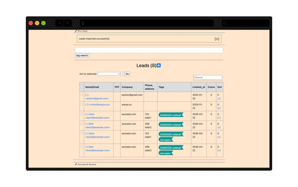
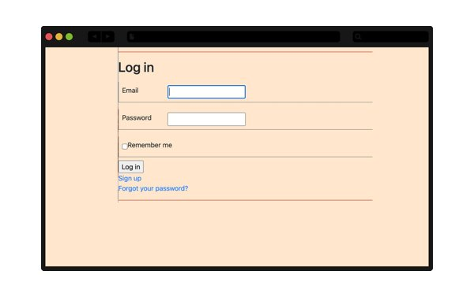

Annesque email is an email client and a customer relationship management (CRM) suite. It is built on the annesque framework, which is a collection of ruby-on-rails engines, react apps, and certain other components.

<p align="center">
  
</p>

The email client allows advanced functionality for a sophisticated email user. Filters, reminders, templates, as well as an AI capability.

The suite integrates with gmail, allowing you to check your mailbox less, and receive less spam. Check out our tutorials and common use cases.

<p align="center">
  
</p>

See the full list of features: [https://annesque-email.wasyaco.com/features?utm_campaign=github](annesque-email.wasyaco.com/features)

Since email data is highly sensitive, we recommend users to setup their instances of annesque crm on-premises, on their own hardware. This allows you to fully control your data, and not give it away to any provider.

Having said that, Wasya Co offers ruby hosting for our apps. We can host the Annesque suite for you, and take care of all configuration requirements. This option is especially appropriate for users who anticipate filing feature requests. We will develop features according to your specification, and deploy them on your instance.

You can rent a cloud-hosted instance of annesque suite with our hosting plan - we offer production-grade deployments starting at $35/mo. See our hosting plans: [https://wasyaco.com/hosting?utm_campaign=github](wasyaco.com/hosting)

Note: If you *are* using the instructions and they are unclear, drop us a line and we'll be happy to work with you to update the instructions.

## System Requirements

The application needs at least 4Gb of RAM to run.

# Build (optional)

Build the docker image:

```
  docker build . -f Dockerfile-ruby275    -t piousbox/ruby275-nginx:0.0.16
  docker push piousbox/ruby275-nginx:0.0.16
```

# Install

We assume that we're running on Ubuntu all around. And our development machines are mac os x, where instead of `apt` we use `brew`.

## Ansible setup

See [docs/setup_ansible.md](Setup Ansible) in the docs.

Having setup Ansible, you can run some playbooks to set up your remote server.

```
  ansible-playbook -i inventory.yml --limit $myhost playbooks/setup-ubuntu.yml
  ansible-playbook -i inventory.yml --limit $myhost playbooks/install-docker.yml
  ansible-playbook -i inventory.yml --limit $myhost playbooks/prepare-postal.yml
  ansible-playbook -i inventory.yml --limit $myhost playbooks/prepare-app.yml
  ansible-playbook -i inventory.yml --limit $myhost playbooks/setup-proxy-vsite.yml --extra-vars "@vars/$myhost.yml"
```


## Production-Grade Application Install

If you used ansible from before, this step was done by playbook `prepare-app.yml`. You can also perform the steps manually, as outlined below.

We use docker for running the application. Clone the repo and run it:

```
  ## on your remote server:
  mkdir -p /opt/projects ; cd /opt/projects
  git clone git@github.com:wasya-co/annesque_email.git
  cd annesque_email
  docker compose up -d
```

This brings up several services:
* application
* redis
* mariadb
* mongo
* localstack
* background worker

The application is exposed on port 9002 by default.

If everything worked well, the client should not be available at your domain, as specified in vars/$myhost.yml .


<p align="center">
  
</p>

## Setup Postal

We use [https://docs.postalserver.io/](Postal Server) for email sending and receiving. It is installed by the ansible run above - or to install it manually, see [/docs/setup_postal.md](Setup Postal).

## Setup DNS

See [/docs/setup_dns.md](Setup DNS).

## Further Steps

In production, you may want to (1) schedule automatic ssl renewal, (2) backups, and (3) uptime monitoring.

In production, you may want to substitute localstack s3 with actual aws s3 storage.

## Development-Grade Setup

The development-grade setup is suitable for individuals who expect to contribute to the development of the application. It is a more complex setup than the one for production.

