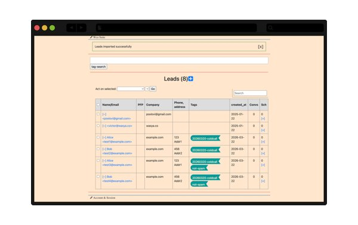
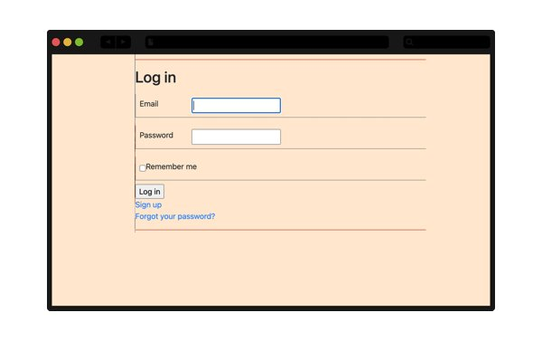

Annesque email is an email client and a customer relationship management (CRM) suite. It is built on the annesque framework, which is a collection of ruby-on-rails engines, react apps, and certain other components.

<p align="center">
  
</p>

The email client allows advanced functionality for a sophisticated email user. Filters, reminders, templates, as well as an AI capability.

The suite integrates with gmail, allowing you to check your mailbox less, and receive less spam. Check out our tutorials and common use cases.

<p align="center">
  
</p>

See the full list of features: [annesque-email.wasyaco.com/features](https://annesque-email.wasyaco.com/features?utm_campaign=github)

Since email data is highly sensitive, we recommend users to setup their instances of annesque crm on-premises, on their own hardware. This allows you to fully control your data, and not give it away to any provider.

Having said that, Wasya Co offers ruby hosting for our apps. We can host the Annesque suite for you, and take care of all configuration requirements. This option is especially appropriate for users who anticipate filing feature requests. We will develop features according to your specification, and deploy them on your instance.

You can rent a cloud-hosted instance of annesque suite with our hosting plan - we offer production-grade deployments starting at $35/mo. See our hosting plans: [wasyaco.com/hosting](https://wasyaco.com/hosting?utm_campaign=github)

Note: If you *are* using the instructions and they are unclear, drop us a line and we'll be happy to work with you to update the instructions.

## System Requirements

The application needs at least 4Gb of RAM to run.

# Install

We're running on Ubuntu all around. We use Docker extensively. The installation is done with Ansible - see [Setup Ansible](docs/setup_ansible.md) in the docs.

Having setup Ansible, you can run some playbooks to set up your remote server.

```
  ansible-playbook -i inventory.yml --limit $myhost playbooks/setup-ubuntu.yml
  ansible-playbook -i inventory.yml --limit $myhost playbooks/setup-app.yml --extra-vars "@vars/$myhost.yml"
```

This brings up several services:
* app
* app_worker
* caddy (or nginx)
* redis
* mariadb
* mongo
* localstack (or use s3)
* postal_web
* postal_worker
* postal_runner
* postal_smtp

Then, configure [Postal Server](https://docs.postalserver.io/) for email sending and receiving. See [Setup Postal](/docs/setup_postal.md). As part of Postal setup you have to configure DNS - see [Setup DNS](/docs/setup_dns.md).

If everything worked well, the client should not be available at your domains, as specified in vars/$myhost.yml .

<p align="center">
  
</p>

## Enable Iron Warbler

To enable or disable the trading module, uncomment or comment out the line in Gemfile that mentions the iron_warbler gem.

Please note: the setup requires a Charles Schwab account. We recommend *disabling* the module if you are focusing on using the email and CRM capabilities.

## Update

Since this project is very much a work in progress, the production setup acommodates updating to the latest version. On $myhost:
  cd $ROOT ; ./r

The script named `r` (for refresh or reload) encapsulates the update logic.

## Further Steps

In production, you may want to (1) schedule automatic ssl renewal, (2) backups, and (3) uptime monitoring.

In production, you may want to substitute localstack s3 with actual aws s3 storage. _TODO Verify App configuration.

## Troubleshooting

Send us a note if you get stuck.

See (docs/develop.md)[/docs/develop.md] for some insights.
